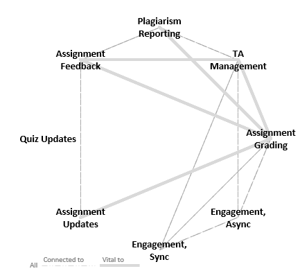

# Co-instructing - A Primer

## History

As the Online CS program grew and more and more students enrolled, class sizes ballooned.  In only a few years, course enrollment rose from 20-30 students per section to over a hundred, and it continued to rise.  Courses that were developed before and during this time tended to have a larger focus on project work, individual evaluation, and open-ended questions.  As courses grew in scale and it became apparent that, even with GTA support, it was extremely difficult to provide the level of feedback necessary for these projects (and the time needed to grade open-ended questions) there was a shift in course design practices toward automated evaluation, more active learning with instructors and TAs in supportive engagement roles.  Many courses continued to grow beyond and the decision was made to begin splitting courses into multiple sections (400, 401, ...).  To ensure all students receive the same quality of education, and to maintain the community of learning that develops around large-enrollment classes, the decision was made to have instructors share the responsibility (and the course sections) for these courses.  This document is intended to provide tips for instructors finding themselves in this position.

## Shared Resources - Canvas, Piazza, Slack, etc...

Within the Online CS program we want to ensure all our students have a positive learning experience, and get the most possible out of our classes.  To that end, the decision was made to have all multiple-section courses (courses with more than one section number in the 400s) to share all learning resources.  This means that all of the following should be common across sections.

- Syllabus
- Piazza Discussion Board
- Synchronous Channel (Slack, Teams)
- Office Hours
- Learning Materials
- Assignments and Grading Methods
- Exams and Grading Methods

Clearly the only feasible method of doing this is to merge the relevant sections:

1. [How to Merge Canvas Course Sections](CourseMerge.html)
2. [Piazza Setup](PiazzaSetup.html)  
    - Create the piazza section by clicking the Piazza nav-bar link, and all students will have access.
    - If desired, grab all student emails and paste them into Piazza's "enroll".
3. [Slack Setup](SlackSetup.html)  
    - Create one Slack workspace (-400 preferred), then email support@engr.oregonstate.edu and ask the other sections' students to be merged into that Workspace. 
4. Teams Setup  
    - The single sign-up link within your course should put all students in the same Team.

All other common tools should utilize Canvas Navigation links, so there should be no need to do any additional special setup for classes with multiple sections. Relatively simple... but how do you work _**with**_ another instructor to manage this?

## Course Aspects

Regardless of your strategy for assigning tasks, the most important aspect of sharing a course is to **communicate frequently with your co-instructor(s)**.  Regular, substantive communication relating to tasks worked on, the difficulty of these tasks, your ability to complete them, notification of completion, encouraging your co-instructors and appreciating their work... these are the hallmarks of a successful partnership.  Therefore, the first step in sharing workload is to meet with your co-instructor and talk things through with them.  Sometimes the relationship and mentalities of co-instructors makes this somewhat trivial, but other times a more systemic approach is needed.  If so, breaking down the general duties associated with the task may help.  A (somewhat abbreviated) breakdown of course tasks and the level which they are connected to other course tasks (1 being "related to" and 2 being "vital to"). Clearly these are debatable but presented to provoke thought...

||TA Management|Assignment Grading|Engagement, Async|Engagement, Sync|Assignment Updates|Quiz Updates|Assignment Feedback|
|:------:|:------:|:------:|:------:|:------:|:------:|:------:|:------:|
|TA Management||||||||
|Assignment Grading|2|||||||
|Engagement, Async|1|1||||||
|Engagement, Sync|1|1|1|||||
|Assignment Updates|0|2|0|0||||
|Quiz Updates|0|0|0|0|0|||
|Assignment Feedback|2|2|0|0|1|0||
|Plagiarism Reporting|1|2|0|0|0|0|1|

From this we can draw a network map of "interconnectivity" of course-related tasks...

.

In theory, it would therefore be possible to divide the course along the lines of "least interconnectedness", separating out responsibilities as follows:

- Instructor A
  - Quiz Updates
  - Assignment Updates
- Instructor B
  - TA Management
  - Assignment Grading/Feedback
  - Plagiarism Reporting
- All Instructors
  - Engagement, Synchronous
  - Engagement, Asynchronous

This is a feasible solution to the problem. The "Instructor A" role naturally aligns itself with the course owner, since they are responsible for Quiz/Assignment/Learning Material updates (with some delegation to other instructors).  If the owner is actively teaching the course, this works well.  It also makes sense from a **group work** mentality to have some separation of tasks among group members.  The difficulty therefore arises mostly in managing [engagement](#student-engagement-in-shared-courses).

### Alternate Strategies

In some cases it will not be possible to come to a suitable arrangement of tasks - this is fine, and has happened before.  The main strategy I've seen resolve this situation was to divide the course **by module** instead of **by task**.  In this method each instructor would choose specific modules to be responsible for.  Instructor A may manage all things related to Modules 1 and 2 (including assignment modification and feedback, and student engagement pertaining to these topics and assignments) and Instructor B would take Modules 3 and 4.  The difficulty in this method would be in properly allocating time and in carefully monitoring student interactions to ensure you don't step on your co-instructors toes, answering questions related to _their_ modules and assignments.

## Student Engagement in Shared Courses

You all do it, all the time.

Ok, ok, fine.  The meat of the matter is that all instructors are expected to be engaging with students, reaching out to them, providing assistance and feedback, establishing an [Online Presence](InstructorPresence.html).  What that means for each instructor may be subtly different.  For example, it's common for our instructors to have additional job duties outside of OSU. This may limit their ability to provide syncrhonous engagement during relevant hours to students.  This instructor may be better suited focusing on Asynchronous engagement! Again, a conversation prior to the beginning of the term will go a long way toward finding an optimal strategy.

## FAQs

- Q: How are eSETs impacted by shared sections?
  - A: Students fill reports for the instructor they originally registered under (original section number). It is helpful to send students a note prior to the opening window for eSETs notifying them of their instructor, or showing them how to look this up. This can be easily managed using the course Gradebook, sorting by the section number, and pasting the email addresses into a BCC field.
- Q: The course owner isn't teaching this term - how do we assign responsibilities?
  - A: A conversation with your co-instructor to figure out preferences is vital, and this should be able to establish who will remain in communication with the course owner with respect to course modifications and improvements.
- Q: It's just not working. Help?
  - A: If you find the working relationship simply isn't happening, please talk to the program Director to air your concerns. Part of their role is to ensure the program runs smoothly, and things aren't smooth when you're bashing your keyboard against a wall. Or so I'm told.