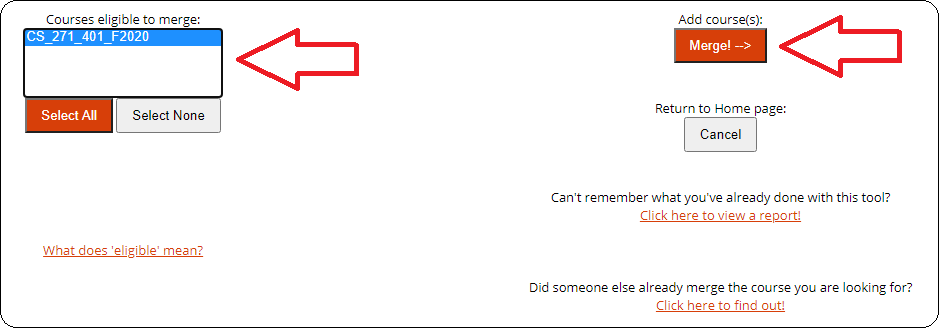
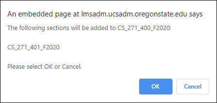
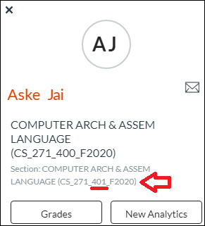

# Course Merge - How To

The Canvas Course Merge tool is used to create combined sections in Canvas courses. This is necessary for almost every online multi-section course. There are some exceptions - you may contact the Director if you believe your course must be excepted from this policy.

After merging course sections, only one course section will remain visible in Canvas. IT is recommended this be the 400 section, so please follow the steps below from within the 400 section of your course.

For more information on the Course Merge tool beyond what is included in this guide, check the [Canvas Course Merge Tool Guide](https://oregonstate.teamdynamix.com/TDClient/1935/Portal/KB/ArticleDet?ID=80690).

## Adding Course Merge to your class' Navigation Panel

To add the Course Merge tool to the course Nav bar...

1. From your course Nav bar, click "Settings"
2. In the "Navigation" tab, find "Course Merge"
3. Click and drag the "Course Merge" tile to the top grouping so it will be available for use, then click "Save"

## Merging Courses

To merge courses...

1. On the left-hand Course Navigation Bar, select "Course Merge" - you may need to authorize your Canvas account.  
  The Course Merge tool will pull from the list of course sections you have available to merge. If a course section is missing, please contact [???]. The current section (the one you added the Course Merge tool to) will not be displayed in this list.
  
2. Select all sections you want to merge with the current section and click "Merge". The below confirmation dialog should pop up in your browser.  
  
3. After this process the other course sections will not be available and all section instructors must work within the 400 section.  

NOTE: If you need to view the student's section number (most likely for grade-related issues) you may click their name from within the grade center and the section will be visible in light gray at the bottom of the popup (note this imaginary student is in the 401 section of CS 271).

## Course Merge TIPS

- Check near the beginning of the term to see if any course sections have been added. If they have, you'll need to merge them in with the others.
- If you merge courses at any point after adding TAs, you'll need to add the TAs again using the "Add TA..." tool. You don't have to remove them and re-add them, just add them again and select any sections they are lacking access to.
- After merging your course sections, you may want to move the merge tool out of the "visible" section in the course navigation settings.