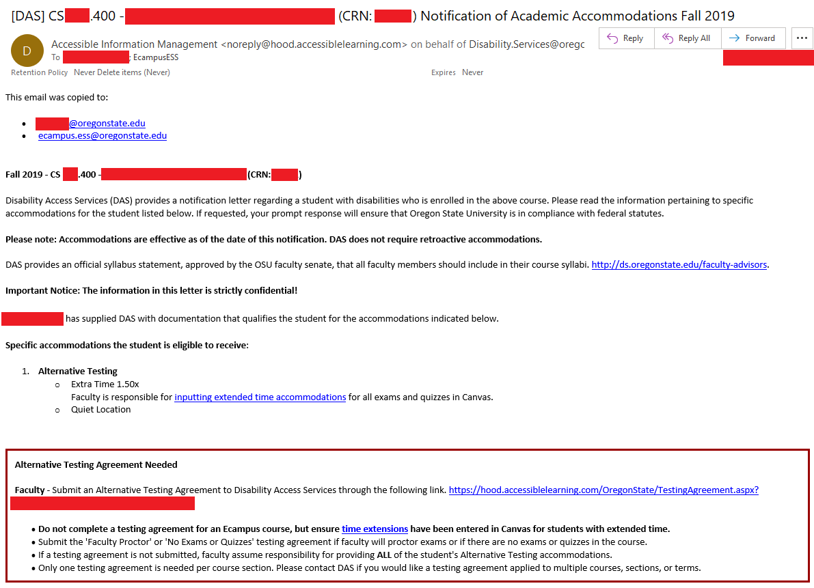

# Disability Access Services (DAS)

## Background

 OSU is required by federal law to make a reasonable accommodation for any students with appropriately diagnosed disabilities enrolled in our classes. For more information on the law and OSU policy see the [DAS Faculty & Advisors page](https://ds.oregonstate.edu/faculty-advisors).  It is also recommended you complete the DAS training and the [Faculty and Staff Tutorials](https://ds.oregonstate.edu/faculty-and-staff-tutorials) to help prepare you to assist students with accommodations. For specific trainings, please see the [PACE Page on Disability Access Services](https://pace.oregonstate.edu/catalog/disability-access-services-faculty-training).

  It is vital to get these accommodations entered as early as possible and notify the student they have been completed.  It goes a long way to help the students feel at-ease if they receive a notifications right at the beginning of the term letting them know they won't have to worry about pestering or reminding their instructor, or fearing that their accommodation hasn't been entered before they take their quizzes or exams.

## The DAS Email

If you have a student who has been issued a DAS accommodation, you will receive an email from DAS near the beginning of the term.  This generally arrives just before the term starts, or sometime during the first few weeks.  

The student name, and the listing of accommodations (along with helpful links) are all included in this one email (don't lose it!).

## Common DAS Services

Some DAS services are common to most classes, and these will be the primary focus of this document.

### Captioned Videos

All videos in each of our classes are required to be captioned.  This may not be required the first term of your course to satisfy an accommodation, but since it increases the accessibility of our courses for numerous students we do require that all published videos in our classes be captioned before they're published.

### Alternative Testing Agreements

The alternative testing agreements are the most common DAS service we provide.  Generally they require extra time (some multiple of the normal exam time) and a quiet location. For eCampus classes they're also exceptionally simple to implement.  

1. First, carefully read the email (note in the above image __"Do not complete a testing agreement for an Ecampus course..."__)
2. In Canvas, open an Exam and select *__Moderate This Quiz__*
3. Search the student name and click the pencil icon to the far right of their name to *Change user extensions*.
4. Enter the appropriate time in *__Extra time on every attempt:__*.
  Note Canvas supplies you with the regular time, so for a 1.5X accommodation on a 60-minute exam, you would enter __30__ minutes extra time.
5. Repeat from 2. for each Test, Quiz, and Exam in your course...

NOTE:  Extra Time applies to anything titled "Quiz" or "Exam" or "Test" - not just midterms and finals.

More information about setting Testing accommodations in Canvas can be found on this [Resource Page](https://ds.oregonstate.edu/accommodations-canvas).

### Flexibility with Attendance/Assignments

For more information on the Flexibility accommodation see the [Video Guide](https://www.youtube.com/watch?v=7ItYSM_yF0c&feature=youtu.be).  Note that despite eCampus courses already being flexible, it is still important to contact the student and work with them to make sure they have the access and flexibility needed to complete the course without undue hardship.  If necessary, you might contact DAS for assistance in setting up the Flexibility Agreement.

## General Accessibility Best Practices

The [Faculty and Advisor DAS page](https://ds.oregonstate.edu/faculty-advisors) has a number of best-practices and tips for ensuring our courses are accessible to the wide range of students in our program.

## Possible Issues

...
