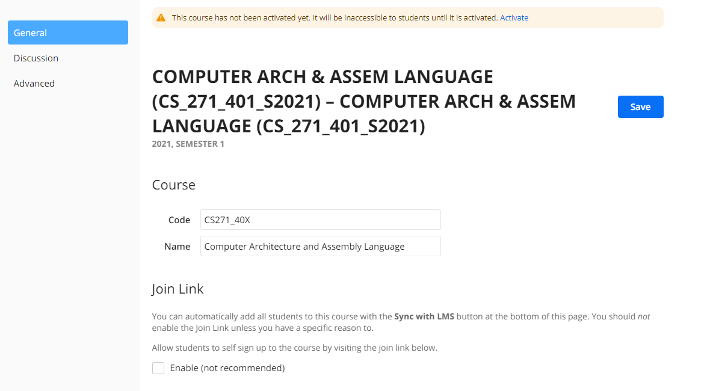
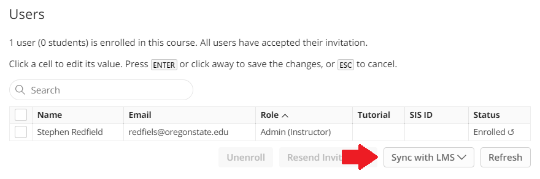

# ED Discussions - How To

ED Discussions is an FERPA-approved, extremely searchable online discussion board that works extremely well for asynchronous Q&A.  We've adopted it for all classes in our program and it should already be in the navigation panel for your course instance.  If not, a guide is in the next section.
Ed is quite powerful, and you may elect to use some of its more advanced features in your classes, but to just get you started, here's what you need to know...
NOTE: You can also read the [Ed support documentation](https://support.piazza.com/) and view the [EECS Ed Training](https://media.oregonstate.edu/media/t/1_lsr8orcb) for more information.

##### Table of Contents  

[Adding Ed Discussions to your class' Navigation Panel](#AddNavPanel)  
[Starting a new Class instance and Enrolling Your Students (and TAs)](#StartInstance)  
[Recommended Settings](#RecSettings)  
[Introduction Thread](#IntroThread)  
[Piazza Q & A](#QA)  
[Piazza Groups](#Groups)  
[Piazza Resources](#Resources)  

<a name='AddNavPanel'/>  

## Adding Ed Discussions to your class' Navigation Panel

To add an Ed Discussions link to the course Nav bar…

1. From your course Nav bar, click "Settings"
2. In the "Navigation" tab, scroll down to the bottom (greyed out) portion and find "Ed Discussion"
3. Click and drag it up to the top (not greyed out) list - it might help to put it near the top with the other important course links.

Please note that Ed Discussions is only installed on the "School of EECS" Canvas sub-account. This means it is not possible to install it in Canvas Studio site (e.g. a Dev site). If you keep a dev site which you copy into each new term, you will have to repeat the steps above every term.

<a name='StartInstance'/>

## Starting a new Class instance and Enrolling your Students (and TAs)

To begin a new class instance, click the Ed Discussions link in the navigation sidebar for your class. If no class instance yet exists, you should see a screen similar to this:

Be sure to update the Code (CSXXX_40X) and Name to something easy for the students to understand. Now scroll down to the bottom of the page, where you'll find the "Users" section. There's an extremely handy button here "Sync with LMS" which will automatically enroll all students, and enroll/provision all special roles (Graders, TAs, other Instructors). Note that you may not have all your ULA/GTA assignments at this point. You can re-sync Ed at any time from Settings->Users.

<a name='RecSettings'/>  

## Recommended Settings

We have found the following Class and Q&A Settings to be the best fit for most classes in the program and recommend you use the same:

- **Instructor Self-Signup**  
  Disabled (If you want to add additional instructors/TAs, you can do it in a batch, rather than having them do it and individually approving them).
- **Posting Anonymously**  
  Enabled (Students from disadvantaged groups in CS have an increased tendency to post questions when given the option to do so anonymously)
- **Folders**  
  A minimal organizational structure may be most relevant (logistics, homeworks, discussions, exams), unless you have mandatory discussions
- **Email settings** *(Accessed from the "Settings" wheel in the top-right)*  
  We don't have a recommended setting here, but you should be aware that Piazza allows you to setup how/when/if you receive emailed notifications of Piazza activity, and this is where you set that up.

<a name='IntroThread'/>  

## Introduction Thread

Online engagement best practices inform us that an introduction thread is important for building a constructive online learning environment.  Piazza is the ideal place for us to do this. At the beginning of each term you should post an introductory thread and request that students post replies.  I recommend attaching a photo of yourself and writing your own introduction here even though you've provided an Instructor Introduction video in the Canvas course.  You should also keep up with the student posts and respond to at least a few. Both of these will show that you're engaged in the forum and that you're an active resource for them to utilize.

<a name='QA'/>  

## Piazza Q & A

The "Q & A" section is your bread and butter here. This is where students ask questions and you have the opportunity to answer them or allow other students to do that. I also recommend getting your TAs involved in the forum.  Here are some key points for the Piazza Q & A Section.

There are three types of Piazza Posts

- **Question**  
Questions are normally used by students. There are two "Formal" feedback boxes, plus the standard Followup Discussion responses.  The "Student Answer" can be written and modified by all students in the class and can only occasionally be relied on for solid answers. The "Instructor Answer" is only accessible to you or your TAs and you should always make sure that questions have correct "Instructor Answers" - even if it is just a reference to a Student Answer or Followup Discussion.
- **Note**  
Notes are the default post type.  They are essentially standard discussion threads and Followup Discussion responses to them can be up to two levels deep. If you are posting a note, I recommend selecting a Folder which is most applicable to the information you're presenting
- **Poll/In-Class Response**  
The in-class poll can be used to gather information quickly of the entire class, without the overhead of managing a Canvas poll.

<a name='Groups'/>  

## Piazza Groups

Groups in Piazza are more annoying to create than in Canvas. The creation mechanism is in the "Manage Class" subsection under "Create Groups".

1. Create Groups  
Calculate the number of groups you'll need, then create them in "Enable Group Based Discussion"
2. Add students  
I recommend using Canvas to generate groups, then pulling the emails from Canvas and pasting them into the Piazza "Manage students in this group" individually.

<a name='Resources'/>  

## Piazza Resources

Piazza has the ability to serve as a repository for course materials (Homework assignments, solutions, lectures, etc).  I don't recommend using this, since we prefer to keep as much information in the Canvas page as possible so information drift can be limited, but if you elect to post this information in Piazza that's fine.
