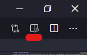

# Ecampus Markdown Workflow

The following is adapted from a webinar ([recording available](https://media.oregonstate.edu/media/t/1_dp8ddk1l)) given by Eric Ianni on the topic of using Markdown and Github Pages to generate source HTML files, which would then be imported to Canvas by an Instructional Designer (ID).

# What is Markdown?

_Markdown_ is actually a mark**UP** language (think HTML and LaTeX). It was introduced in 2004 as a way to let people _easily_ write human readable content that could be easily converted into HTML. To demonstrate this readability let's look at a small example:

___
Content as shown in the browser:

#### Page Goals

1. **Describe** how Markdown can be used to generate Canvas content
2. **Demonstrate** simple Markdown commands
3. **Identify** ways course developers can assist Ecampus
4. **Identify** ways Ecampus can assist course developers

___
The HTML used by the browser:

```HTML
<h4>Page Goals</h4>
<ol>
	<li><strong>Describe</strong>how Markdown can be used to generate Canvas content</li>
	<li><strong>Demonstrate</strong>simple Markdown commands</li>
	<li><strong>Identify</strong>ways course developers can assist Ecampus</li>
	<li><strong>Identify</strong>ways Ecampus can assist course developers</li>
</ol>
```

___
Markdown used to produce the HTML:

```markdown
#### Page Goals

1. **Describe** how Markdown can be used to generate Canvas content
2. **Demonstrate** simple Markdown commands
3. **Identify** ways course developers can assist Ecampus
4. **Identify** ways Ecampus can assist course developers
```

When reading raw HTML, a person needs to mentally discard all the tags. Markdown's "tags" are much more understated, thus not disrupting reading as much. Also, Markdown's syntax also is much more condensed, making it easier to write.

## Why use Markdown?

So what can Markdown do for us as course developers? Why would we want to use it instead of using Canvas directly or another word processor like Word?

### Rich Text Editors are the Worst

How many times have you wanted to include something as simple as a code snippet in your content only to be thwarted by the _Rich Text Editor_?

  
Suppose you want to make "mystery_func" in the following example into a code snippet. We highlight it and select preformatted.

  
Clearly this didn't work as we expected! The only solution Canvas offers is to use the _HTML Editor_, which is tedious and not the easiest if you are unfamiliar with HTML.

As we will see in a moment, Markdown can produce HTML that can be easily copied and pasted directly into Canvas! 

### Develop Content Like You Do Software

Many of us spend a large amount of time inside a code editor and in many ways it just feels _right_. Why give up that warm feeling of home to create our courses? Well with Markdown, you never have to leave your editor of choice!

### Come On, Everybody's Doing It!

For many of us, our primary experience with Markdown is in a GitHub `README.md`. But Markdown is gaining popularity in other sectors. Teams allows limited Markdown to be directly written in the standard message field. Even Ed allows in-line Markdown on posts (for the web app, but not the mobile one). Knowing how to use Markdown can really help with your messaging to the students.

## Common Markdown

Honestly, Markdown is a very small language and if you wanted, you could probably get it put onto a mug!


We won't be going over all the Markdown commands here, but you can find a very detailed cheatsheet from [GitHub](https://github.com/adam-p/markdown-here/wiki/Markdown-Cheatsheet).
### Headers

Use a `#` to indicate a header. This equivelant to `<H1>` tags in HTML. To shrink the size of the header, just keep adding `#`'s! For example, `###` is the same as `<H3>`

### Text Emphasis

* _Italics_ are created using single underscores or astrisks. Both `_italics_` and `*italics*` render as _italics_.

* **Bold** is applied using double underscores or astrisks. Both `__bold__` and `**bold**` render as **bold**.

* Combining them gets a bit trickier, but can be done by combining underscores _and_ astrisks: `**This is bold and _this is bold italics_**` renders as  **This is bold and _this is bold italics_**.

### Images

Images are inserted using ``. The path to the image can be relative like `./images/mug.png` or a url. The picture of the mug above uses the following: ``.

### Code

Markdown has two ways of inserting code: inline and blocks.

* Inline: Use backticks (the one to the left of the 1 key) to surround the code snippet: `` `code snippet` `` renders as `code snippet`.

* Block: These are better suited for multiline code snippets. You can even designate syntax highlighting by specifying the language you are writing. To use, surround your code above and below with three backticks ` ``` `. If you want to specify a language, this goes immediately after the first three backticks.

````markdown
```python
def hello_world():
	print('Hello World')
```
````

```python
def hello_world():
	print('Hello World')
```

### HTML

Markdown allows for directly writing HTML code into the same document. This is very useful as Markdown, while useful, is missing some common things like underlining. To produce <u>this underlined statement</u> all I had to do was surround it with `<u></u>`.

It also makes it very easy to embed content from other pages. This includes things like YouTube videos, but more importantly for our purposes...

<iframe height="400px" width="100%" src="https://repl.it/@coeCS362/providinganswers?lite=true" scrolling="no" frameborder="no" allowtransparency="true" allowfullscreen="true" sandbox="allow-forms allow-pointer-lock allow-popups allow-same-origin allow-scripts allow-modals"></iframe>

# Writing Markdown

One of the best parts of writing Markdown is that you can do it in _any_ text editor! I am going to go over two methods I have personally tried.

## Method 1 - VS Code

VS Code requires zero work on your part to allow you to preview what your Markdown would look in a browser.

First you need to open the Markdown file you want to preview. Then you need to click the "Open Preview to the Side" button shown below.



You will now have a real time render of your Markdown.


One word of warning about VS Code's solution. If you copy directly from the preview panel and paste it into Canvas, some of the formatting may be messed up. It is better to use the Github solution below.

## Method 2 - Emacs

For those who suffer from the unfortunate addiction called _Emacs_, it is possible to set up a workflow that allows you to write in Markdown and have it rendered in a browswer in real time. This is very useful when getting used to Markdown and you want to ensure everything looks as you would expect.


Most folks don't want to use Emacs so the setup won't be detailed here, but if you are interested send Eric an email ([iannie@oregonstate.edu](mailto:iannie@oregonstate.edu)).

# Enter GitHub

What I didn't mention when discussing the development of Markdown is that the original authors stopped developing it the same year it was first released. One of the biggest reasons for Markdown's continued use could be that GitHub adopted it as the language for their `README.md` files. 

## GitHub Markdown

GitHub's love affair with Markdown has lead them to create their own variant. It follows pretty much all the rules of Vanilla Markdown, but it is rendered exactly how GitHub wants it. One example of this is the above mentioned Syntax Highlighting for code snippets. As you can see in the image below, GitHub's Syntax Highlighting is more in line with what you would expect.


What is even better about GitHub, is that _any_ Markdown file hosted in a repo is automatically converted when visiting the page. This will come into play later when we discuss working with Ecampus. The one caveat to this, is that GitHub won't render embedded `<iframe>`'s like our Replit above. No worries though, there _is_ a GitHub based solution!

## GitHub Pages

GitHub now allows hosting of websites using repos. This feature can also be used to convert our Markdown files into actual HTML pages, which means any embedded `<iframe>`'s will work as expected!

To enable, just go to your repo's settings and under GitHubPages select which branch you want to use: most likely `master`. You can even choose a theme for how your page will be rendered; I am partial to _Merlot_.


You will not be provided with a link to your hosted page. Unless you have an `index` file, click this URL will give you a 404 error. But we can use it to navigate to our converted Markdown files. 


The Markdown file I am typing into right now is called `ecampus_workflow.md`. To visit the GitHub Pages version, I just tack this onto the end of the above URL: `https://ericianni.github.io/ecampus_workflow/ecampus_workflow`. Now I have a fully fleshed out webpage that I can easily share for testing or feedback. I have found this very useful for prototyping lessons before I have somewhere to put them on Canvas.

# What about Ecampus?

You may be asking, "This all sounds nice a good, but how does this help course development when it comes to Ecampus?" This is a very good, if a bit impertinent, question. If you have developed courses in the past, you may have had to handle everything from content creation to setting up everything on Canvas yourself. This meant less time could be dedicated to what you do best: create engaging content.

No more! Just as we are subject matter experts, Ecampus are Canvas experts (among other things). They have extensive experience with taking a wide range of content types and fashioning a fully functional Canvas course. That is not to say we can't do our part to make the process smoother.

## Passive Communication

While Ecampus will meet regularly with you for formal check-ins, they are often weeks apart. How can we as course developers best communicate outside of meetings? Sending emails is very important, but could quickly flood an inbox if you send one every time you have made progress on your course.

When developing my course, I decided to try something I am calling "Passive Communication." At it's core, it is a system where I update a shared website with my updates as I make them. My Ecampus liason would then be able to check in at any time to see my progress, but more importantly know when something was ready to be imported to Canvas.

Much of what I am going to describe below are things I would do anyway for my own organizational purposes, but proved to be crucial with a smooth working relationship with Ecampus.

### Create an Outline

The first step is to create an outline. I chose to do this is Markdown and host it on GitHub. This outline included the course CLOs, module names, planned explorations, and assignments.

```markdown
## Course CLOs

1. **Apply** automated tools such as _make_ and CVS in a realistic setting
2. **Describe** the cost-benefit trade-offs inherent in the use of automated tools for building software and configuration management
3. **Describe** several techniques for validating and measuring the quality of software
4. **Apply** testing techniques for validating and measuring the quality of software
5. **Use** appropriate techniques and tools, including a debugger, to locate program faults
6. **Describe** several types of maintenance processes associated with correcting and enhancing software systems
7. **Participate** effectively in a software inspection/code review
8. **Participate** effectively in a team environment

## Proposed Course Modules

* Start Here
  * Instructor & TA Communication Policy and Information
  * Teams How-To
  * Useful Links
  * Course Policy Quiz (Non-graded Quiz)
* Week 1 - Tool Setup
  * CLO(s): 1, 5
  * Setup Git and Conda (Exploration)
  * Setup Pycharm (Exploration)
  * Version Control System (Exploration)
  * Git Activity (Activity)
	* Due: Week 2 Monday
```

Not only is it just a good idea to have a plan, this file helped Ecampus speed ahead and build the skeleton of my course. Each one of these buleet points was able to be created, with appropriate due dates, without me needing to actively ask my Ecampus liason.

### Trello

While the above mentioned outline was a good starting point, it was static and didn't provide Ecampus with a snapshot of what needed doing by each party at any moment. I decided to use an online "corkboard" to share with Ecampus: Trello.

Trello offers a free service that is more than enough for our needs. Signing up is easy by going to [www.trello.com](www.trello.com) and logging on with your OSU Google account. Once you have an account, you can create a "Board" which you can invite others to view or edit.

Trello allows users to create "cards" that represent tasks that need doing. These cards exist in one of multiple user defined "tables." The idea is that each table represents a different status for each card. To help passively communicate to Ecampus the state of the course, I created the following tables:

* **Things To Do** - where I created a card for each bullet in my course outline
* **Doing** - the cards I was actively working on
* **Done** - the cards that I felt were ready to be imported
* **Imported** - Ecampus would move the **Done** cards here when imported to Canvas
* **Completed - Reviewed by Ecampus** - Ecampus would move any *Imported* card here once it was published on Canvas


You may notice that some cards have different colors attached to them; these are called "Labels." I found it useful to create different color labels to represent different types of content. For example, <span style="color:green">green</span> labels were used for _Explorations_ while <span style="color:orange">orange</span> labels were for _Homeworks_.

Trello cards can also have details within them. It is possible to add descriptions, create checklists, and make comments. I would often use checklists to help me visualize what I needed to do and this also helped Ecampus understand how **Done** the **Doing** cards were. The comment feature was used to let Ecampus know where to find the uploaded content on GitHub by linking to the URL.


Once a card moved to *Done*, Ecampus could follow the provided URL and almost literally just copy and paste the rendered Markdown directly into Canvas.

#### GitHub Source


#### Canvas Result After Pasting


### Making Code Prettier

You may have noticed that the code as it appears in Canvas doesn't have our nice GitHub _syntax highlighting_. This is an unfortunate limitation of Canvas' style sheets, which we can't change. While most code samples are readable without it, syntax highlighting adds a nice touch and makes the content look more professional.

In order to get a similar look is to generate HTML code that includes the style information inline. 

#### Hilite.me

Perhaps the easiest to use is [Hilite.me](www.hilite.me). It is browser based so all you have to do is type in your source code, pick the programming language, and pick a style. The webpage will then generate HTML that you can directly paste into your Markdown.

##### Drab...


##### Becomes Fab!

<!-- HTML generated using hilite.me --><div style="background: #f8f8f8; overflow:auto;width:auto;border:solid gray;border-width:.1em .1em .1em .8em;padding:.2em .6em;"><pre style="margin: 0; line-height: 125%"><span style="color: #008000; font-weight: bold">def</span> <span style="color: #0000FF">hello_world</span>():
    <span style="color: #008000; font-weight: bold">print</span>(<span style="color: #BA2121">&quot;Hello world!&quot;</span>)
</pre></div>

#### Pygments

If commandline is more your speed, you can use something called [Pygments](www.pygments.org). As you could probably gather from the name, this is a Python based tool that can be run against source files and it will output raw HTML.

<div class="highlight" style="background: #f8f8f8"><pre style="line-height: 125%"><span></span><span style="color: #008000; font-weight: bold">def</span> <span style="color: #0000FF">hello_world</span>():
    <span style="color: #008000">print</span>(<span style="color: #BA2121">&quot;Hello world!&quot;</span>)
</pre></div>

## Be Kind to your ID

As you can see, this workflow is designed to be very low maintence and allow for you to seamlessly hand off content to Ecampus with a minimum of communication overhead. That said, there are things that can make the life of your Ecampus liason much easier.

### Images

Copying and pasting the rendered Markdown from GitHub will work for any embedded images. The only problem is that the images are linked to the GitHub repo and aren't hosted on Canvas directly. This is a problem as Ecampus, rightfully so, wants to have all the content contained in the same place, including images.

When initially working with Ecampus, my liason mentioned to me that he was being slowed down by having to locate the name of the image on the page, then download it from GitHub, and then upload it to Canvas to be embedded. Being the helpful gent that I am, I proposed another solution that seemed to work very well. 

First, next to _every_ embedded image I would provide the name of the file.


Second, I created a file structure for each week's module to house the images. I would upload these images myself instead of asking Ecampus to download them from GitHub.

* Files
  * week1
	* images
	  * activity1
	    * sample.png
	  * exploration_setup
	    * verbosity1.png
		* verbosity2.png
  * week2
  * ...

This setup allowed my Ecampus liason to quickly copy and paste from GitHub and replace all the images one by one with the files now on Canvas.

### Update The Shared Resources

The workflow only works as well as both parties are committed to using it. If you aren't frequently updating the status of each task on Trello or aren't pushing changes to GitHub, the system will fall apart. This workflow is designed to eliminate common bottlenecks on collabrative projects by reducing the amount of active communication needed. If our Ecampus liason needs to constantly contact us to see if any material is ready to import, then we have failed. 

It is also useful as a way to offload some of both of your cognitive loads freeing you to focus on improving the course. By using Trello, Ecampus can perform daily checkins between the formal meetings to see progress towards delivery. This can reduce their stress levels, which in turn can reduce yours.

## Things your ID can do to help

Now, this workflow isn't all about what we can do for Ecampus! How said helping others means we can't also help ourselves. By making our content as easy as possible to get into Canvas, we free up some time for Ecampus to help us really make our courses pop!

### Canvas Wizadry

Remember how I said Ecampus was experienced with Canvas? They have the experience and knowledge to do things that we are not even sure are possible. If I had an idea that I thought would benefit the students' learning, I would ask my Ecampus liason even if I had no idea how to do it myself. And lo and behold, just like the Imagineers making magic happen when Walt Disney (can you believe my ego?) asked for something impossible, my liason always came through. 

One such act of Canvas Wizadry was collapsable elements. I employ an _active learning_ style in all my course content and one of the key elements is having the students reflect _during_ the exploration. This is easy to do in a classroom, but online it was proving difficult to ask questions without having the answers immediately visible, thus defeating the purpose. So I asked if there was some way of hiding the answers. 

My Ecampus liason came back with this brilliant solution!

#### Posit Question


#### Giveth Answer


In case you are curious what this looks like in actual HTML, take a look at this nightmare:

```HTML
<p>
	<span class="element_toggler" style="background-color: #ffffff; color: #d53900; font-weight: normal; font-style: normal;" aria-controls="group_1" aria-label="Toggler toggle list visibility" aria-expanded="false">Click here to reveal the answer.</span>
</p>
<div id="group_1" style="display: none; background-color: aliceblue; padding: 10px;">These types of tests are used to verify that the software meets the requirement specifications when it comes to functionality; does the software do the things it is expected to do?
	<p><strong>Examples:</strong></p>
	<ul>
		<li>Does clicking "save" actually save the changes to the hard drive?</li>
		<li>Does the search algorithm actually find the shortest path?</li>
		<li>Does the isItPrime function correctly identify prime numbers?</li>
		<li>Does the database correctly supply responses to the client?</li>
	</ul>
</div>
```

### Importing to Canvas

This whole workflow is about making it easy for Ecampus to import things into Canvas, so why not just do it ourselves? While many instructors do choose to handle the import themselves, I chose a different path. 

The primary reason is that Ecampus is _good_ at Canvas where I am _competent_. Could I have done all the imports myself? Of course, but it would have taken me longer than it did for my liason. 

Ecampus also has a better understanding of all the pieces that have to be in place before a course is ready to publish. I am not talking about the lessons, but all the administrative elements that go into a course: due dates, where to put the CLOs, and setting a module unlock schedule. All these things I have done myself, but I do it only once every 11 weeks so have to reteach myself, whereas Ecampus does it daily.

My liason was also able to handle getting all my video content captioned and to ensure my course met the requirements of DAS. These are regulations that I was not very familiar with so it was a blessing to have someone check my work. 

Finally, Ecampus also has the ability to create animations for instructors and to generate icons/banners/art. These are things that can really make a good class _great_. For example, I wouldn't have thought of using icons as part of my Horizontal Rules or to add a Git log diagram to the course banner.


# Wrap-Up

Using a similar workflow as described here, your course development will only get easier for all parties involved. It will help reduce stress levels and allow you to focus on creating exciting and engaging content for the students. Likewise, your Ecampus liason will be happy with the clean HTML generated by this method.