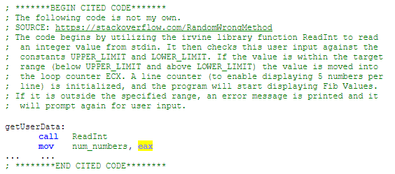

# Preventing Academic Misconduct

One primary goal of the Online CS program is to provide our students the tools they need to be successful in industry.  The corollary to this is that the program is also responsible for providing Industry with students who are well-prepared to work.  The question of Academic Integrity is clearly one which is extremely relevant, with the clear conclusion that prevention is superior to punishment.

OSU Student Life also has some [General Tips](https://studentlife.oregonstate.edu/studentconduct/general-tips) and [Assignment Tips](https://studentlife.oregonstate.edu/studentconduct/final-project-assignment-tips) for prevention of academic dishonesty.  What follows are the Best Practices for our Online CS program.

## Syllabus - Be Specific

One of the best ways to prevent academic misconduct is inform the students specifically what constitutes misconduct in your class in your Class Syllabus.  A good place to start is referencing Section 4.2 of the [Student Code of Conduct](https://studentlife.oregonstate.edu/sites/studentlife.oregonstate.edu/files/code-of-student-conduct-102218.pdf). The [Academic Misconduct Faculty Page](https://studentlife.oregonstate.edu/studentconduct/academicmisconduct-faculty) has some "Suggested Syllabus Statements" at the bottom of the page which are useful examples.  The students may assume whatever policy was present in their previous class will hold true for yours as well, and this is rarely the case.

All Syllabi for Online CS courses must conform to the following rules...

### Don’t Misinform Students about the Academic Misconduct Process

While it can seem a strong deterrent to claim you can fail students’ course grade for once instance, that power actually resides at the College level.  Instructors are only able to make recommendations for penalty, though it is acceptable to inform students what the normal penalty is. First offenders almost always receive a failing **Assignment** grade. Second offenders have a high chance of being removed from the program.

### Citation of References

Due to confusion across the program, we are presently discouraging instructors from mentioning citation of code.  Some specific courses and cases have a simple, universal terminology for what it means to “cite code”, but the vast majority of students don’t have a good understanding of this topic and including verbiage related to code citation has been observed to be confusing for students.

If you believe you are in a specific use-case where citation is well-defined and acceptable in your course, this definition must be exacting and well-expressed to students. Including a statement such as the following in your syllabus is required.

*Any use of code other than your own must conform to the following guidelines:*

- *Comment block endpoints of the non-original code (BEGIN...END)*
- *A non-source statement (e.g. “This is not my original code”)*
- *A detailed prose description of the functionality of the code (How it works)*

*EXAMPLE:*

### Specific Examples for Students

Another required (for Online CS) section of the syllabus will enumerate specific examples of what the instructor will/won’t be considering Academic Misconduct.  For example, using work from a previous term may be a violation, but that is up to the instructor to spell out. Instructors have a large degree of latitude in determining what they **don’t** consider a violation of Academic Integrity but cannot exceed the Student Code of Conduct with things they **do** consider a violation.  Regardless, they must spell this out. An example of this section of the syllabus can be found below. Some things you might consider when making this section...

- What are some common instances of Academic Misconduct you’ve seen in the past?
- What are the students’ learning resources?
- If a student is stuck on a programming assignment, how will they get themselves un-stuck? How will they know this is the proper method?
- ...?

___

#### Academic Integrity DOs and DON’Ts

- You are encouraged to discuss course content with each other, including general discussion of homework assignments and how to fix specific issues.
You may post minimally-functional code snippets (or less) from your assignments to Slack or Piazza.
- You may ask conceptual questions related to optimizing your code on Slack or Piazza.
- You may post Weekly Exploration questions / solutions in Slack or Piazza.
- You may not post any complete functions to Slack or Piazza.
- You may not post any exam questions or solutions in any form.
- You must make any git repo you post this code on private, with the exception of the 
Portfolio assignment.

#### Perfection is the enemy of ‘done’

Not everything you submit has to be 100%. Especially in the Exploration questions, we’re most interested in having you learn the concepts. That is why the relative assignment weight is so low. Please make use of other students, the TAs, the Instructor, google, etc… when working through these explorations.  Getting the right answer is great, but understanding the wrong answer may be even better!

___

### Boilerplate Language for All Syllabi

All syllabi must have the information from the official student code of conduct.  Instructors may choose either option below to paste into their syllabus.  **Option #1** is an abbreviated summary which links to the official Code. **Option #2** is the excerpted portion related to actual violations of Academic Integrity.

#### Option #1

___
The Code of Student Conduct prohibits Academic Misconduct and defines it as:

    Any action that misrepresents a student or group’s work, knowledge, or achievement,
    provides a potential or actual inequitable advantage, or compromises the integrity 
    of the educational process.

To support understanding of what can be included in this definition, the Code further classifies and describes examples of Academic Misconduct, including cheating, plagiarism, assisting and others. See the [Code of Student Conduct](https://studentlife.oregonstate.edu/sites/studentlife.oregonstate.edu/files/code-of-student-conduct-101519.pdf) for details.

You are expected to do your own work and demonstrate academic integrity in every aspect of this course. Familiarize yourself with the standards set forth in the OSU Code of Student Conduct Section 4.2. You must only access sources and resources authorized by the instructor. You may not show your work to any other current or future students without the instructor's authorization.  Violations of these expectations or the Code of Student Conduct will be reported to the Office of Student Conduct and Community Standards.  If there is any question about whether an act constitutes academic misconduct, it is your responsibility to seek clarification and approval from the instructor prior to acting.

___

#### Option #2

___
The Code of Student Conduct prohibits Academic Misconduct and defines it as:

    Any action that misrepresents a student or group’s work, knowledge, or achievement, 
    provides a potential or actual inequitable advantage, or compromises the integrity 
    of the educational process.

To support understanding of what can be included in this definition, the Code further classifies and describes examples of Academic Misconduct, as follows.

Prohibited behaviors include, but are not limited to doing or attempting the following actions:

- Cheating. Unauthorized assistance, or access to or use of unauthorized materials, information, tools, or study aids. Examples include, but are not limited to, unauthorized collaboration or copying on a test or assignment, using prohibited materials and texts, unapproved use of cell phones, internet, or other electronic devices, etc.
- Plagiarism. Representing the words or ideas of another person or presenting someone else's words, data, expressed ideas, or artistry as one's own. Examples include, but are not limited to, presenting someone else's opinions and theories as one's own, using another person's work or words (including unpublished material) without appropriate source documentation or citation, working jointly on a project and then submitting it as one's own, etc.
- Falsification. Fabrication or invention of any information. Examples include, but are not limited to, falsifying research, inventing or falsely altering data, citing fictitious references, falsely recording or reporting attendance, hours, or engagement in activities such as internships, externships, field experiences, clinical activities, etc.
- Assisting. Any action that helps another engage in academic misconduct. Examples include, but are not limited to, providing materials or assistance without approval, altering someone's work, grades or academic records, taking a test/doing an assignment for someone else, compelling acquisition, selling, bribing, paying or accepting payment for academic work or assistance that contributes to academic misconduct, etc.
- Tampering. Interfering with an instructor’s evaluation of work by altering materials or documents, tampering with evaluation tools, or other means of interfering.
- Multiple submissions of work. Using or submitting work completed for another or previous class or requirement, without appropriate disclosure, citation, and instructor approval.
- Unauthorized recording and use. Recording and/or dissemination of instructional content without the express permission of the instructor(s), or an approved accommodation coordinated via Disability Access Services.

___

## Assignments

Reuse of assignments is one primary source of Academic Integrity violations in Computer Science.  It can be difficult to find multiple methods of exercising the same concepts, and complete assignments and rubrics, especially when incorporating tools such as Gradescope, are time-consuming to create.  Regardless, making regular adjustments to course assignments and rotating in new assignments are effective methods in preventing plagiarism. This is one of the primary tasks of the Course Owner. Suggested practices include:

- Create multiple assignments which exercise the same principles. Rotate these assignments between terms.
- Make regular (term-term) smaller alterations to each assignment so even students who wish to plagiarize an online source will have to make alterations beyond the variable renaming, comment changes, etc.  Ensure these changes are propagated to the rubrics.
- Make significant changes to the Course Portfolio Assignment every term, since this is guaranteed to be posted publicly.

## Exams

Within Canvas Quizzes it is trivial to transfer information from one exam session to another, or even one term to another.  Use of Proctors reduces the severity of this, but it is still fairly simple to accomplish.  There are several methods which may be employed to reduce the impact of this disallowed transfer of information.

- Have exams Proctored.
- Do not release Exam Solutions.  This can be a hard sell to students, but if it is done transparently and there are abundant other learning resources, it can work.
- Use **Question Banks** *extensively*. Group questions by specific topic, rather than by section.  Utilize your TAs in finding different ways to ask about the same concept.
- Write **Formula Questions** in Canvas Quizzes and supply a wide range of input values.  Be careful to specify the answer format for these question types.
- Course Owners should add alternate question banks for rotating every term (e.g. "Ch5 Conceptual - Subnets (Final) (v3))")
- Enable **Shuffle Answers** within Canvas Quizzes.  Do not use answers such as "All of the Above" when shuffling answers.

## Closing Thoughts and Additional Best-Practices

Cheating companies act in a predatory manner - they will ruin lives for a few bucks. Oftentimes, companies reach out and try to blur the line to students, trying to trick them into trading money for morality (*“What's wrong with accepting an offer from someone else to tutor?”*)... and then the line is blurred more, step by step. They will fish the students, provide support, then blackmail them with the threat of turning them in. We should be proactive in warning our students about this and teaching them correct principles so they can govern themselves properly.

- Don't let people get into the position of “needing” to do panic cheating. 
- Check in with students before deadlines. Are they procrastinating? 
- Reach out and give extra assistance and head off the “need” to cheat by seeing who has turned in, who hasn't, and who is or isn't making posts in communication tools.
- Break assignments into components: these are more easily digestible, and help people complete things on time.
