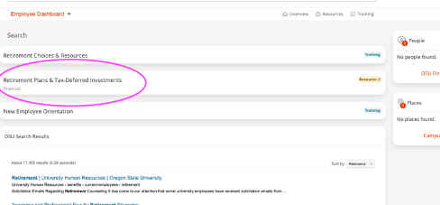
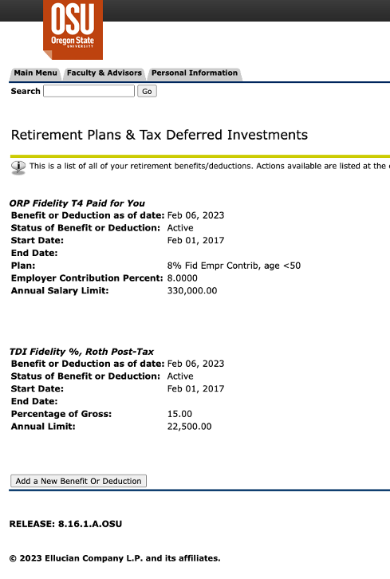

# Retirement Savings Benefits

**Disclaimer**: This document does not intend to provide financial advice, it is only
to inform faculty of the retirement savings benefits available as an OSU employee.

This page is a placeholder (and reminder) to provide new faculty with information
regarding retirement savings benefits at OSU.

Keep an eye our for a Retirement Plan Notification email sent to your OSU email
account in your fourth month of employment.

First, you select one of two main plans: PERS or ORP.

Then, you can opt-in to additional savings within each main plan.

## Handy Links

[Academic and Professional Faculty Retirement Programs](https://hr.oregonstate.edu/benefits/current-employees/retirement/retirement-programs/academic-and-professional-faculty)
[Create / Access Retirement Accounts](https://hr.oregonstate.edu/benefits/current-employees/retirement/createaccess-retirement-user-accounts)
[Voluntary Retirement Savings Programs](https://hr.oregonstate.edu/benefits/current-employees/retirement/voluntary-retirement-savings-programs)

## What Plan am I Enrolled In?

You can check your existing retirement benefits selection by visiting MyOSU and
selecting Retirement Plans and Tax-Deferred Investments.

This will take you into Banner (another system) which shows your currently selected
retirement savings plans.

### Changelog

2023 May Drafted by Yong Bakos. I am not responsible for bad financial advice!
