# Teams - How To

Microsoft Teams is a multi-platform connectivity app which is FERPA-approved and incorporates online chat and videoconferencing. It allows us to synchronously connect with our students to enhance their learning and increase student satisfaction. Think of it as a much-more-interactive chat client.  A Team is essentially a membership subset specific to some THING (like a course section, or the online program, or all OnlineCS instructors).

Teams is used to communicate with your students and encourage their learning in what feels like a much more in-person way. We've decided to incorporate it the standard tool for synchronous communications in our courses, and encourage you to employ it as much as possible.  This can take the form of office hours for yourself and your TAs, and tele-/video-conferencing at-a-click.  It can also be a place for you to talk about course-related and program-related materials in a more personal and approachable setting.  We will also use it for intra-departmental communication.

There are multiple methods to connect to Teams.  We recommend using the desktop application and mobile app. You can find links to download these at the [University IT Teams Site](https://is.oregonstate.edu/teams){:target="\_blank"}. You can also log in directly to Teams through a browser via the [Microsoft Teams URL](https://teams.microsoft.com/){:target="\_blank"}: https://teams.microsoft.com/ 

NOTE: Chris Thompson, College of Engineering IT Director, has made available a [recorded session demonstrating normal Teams functionality](https://it.engr.oregonstate.edu/lists/lt.php?tid=cUhbUwNVU1dQBRRTWgdVSAdTBwgaA1MEBxoHUQ0BB1UOBQxSVAVOAwBVCgdaB1BIVQdUCxpWAwsBGl9VUgFLAVwHAQIEBwRSVAQPTQYHVVNRUVcIGgQOV1MaUlQNXUsJCwVaHVAEBwdUVFgEUgBXBA){:target="\_blank"}. The [University IT Teams Site](https://is.oregonstate.edu/teams){:target="\_blank"} also has Knowledge Base articles and Trainings available.

## Connecting to our Departmental Team

You should receive an email inviting you to our Departmental Team. After you've downloaded Teams, when you boot it up you should arrive at a login similar to the following.

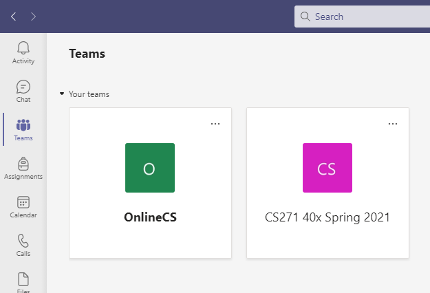

Click on the OnlineCS Team - this will be (alongside email) the primary communication medium for EECS OnlineCS-related issues. Now you're in!

Here's how we use the OnlineCS Team. Feel free to request an invite if you're not already in some of these channels, and you'd like to be!

- **_Teachers_** (Locked)  
  Ad-hoc discussions for all of our online instructors. Clarification of policies, requests for assistance/information, etc)
- **_General_**  
  Questions/Interaction with staff/advisors associated with the OnlineCS programs, or general program questions/conversation.
- **_Course Development_** (Locked)  
  Conversations related to course development, current courses under development, etc.. Also a great place to pick brains of more experienced course developers.
- **_Random_**  
  Random chat among department personnel (you!) that doesn't fit in General. Pet pics welcome.

## Starting a new Class Team

Now that you're set up and ready to go, it's time to create a Team for your students to connect to!  We are working on a method with increased automation, but for now the following is a workable method:

1. Open the [University IT Teams Site](https://is.oregonstate.edu/teams){:target="\_blank"} and select "Request a Team".  
  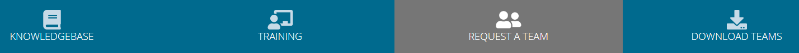
2. Click the Big Orange "Request Service" button. This will require you to log in with your ONID.
3. Fill in the form with your class information. We recommend including the course number, relevant section material, and the term, for record-keeping purposes.  
  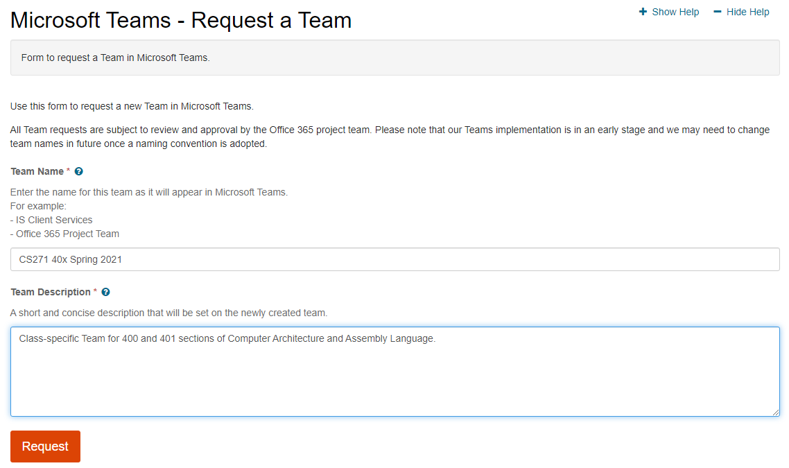
4. After you submit the request you should see a "Request Submitted" page.  You will also receive an email that your Service Request titled "Request for Team ...." has been submitted.  
  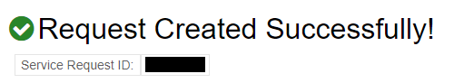
5. From here, it will take some time (1-2 business days) to have your Team added.  When it is, you'll receive an email from IT adding a comment to your service request. In Teams, you should also get a popup like the following:  
  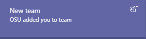

## Configuring your Class Team

Now that you have a Team for your class, it's time to get it properly setup for use.  There are a few setup procedures which follow here. To get started on setting these up, open Teams and get into the "Manage Team" window by clicking the "Three Dots" dropdown, then selecting "Manage Team".

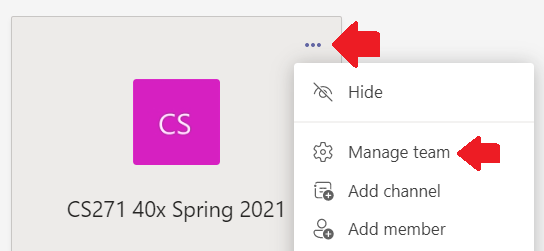

### Improve Team Name & Description

From anywhere in Teams, you can select that same dropdown window and "Edit Team" to modify the Team name and description to be more intuitive and/or useful for the students.

### Update Team Icon

Updating the Team Picture will make it easier to navigate to the correct class' Team for students and for yourself.

1. Download your class' Teams Icon from the [Teams Icon Repository](https://drive.google.com/drive/folders/1RKscY825h54A9blY-hL6_dQesOgg6TG9){:target="\_blank"}.
2. From the "Manage Team" window, select the "Settings" tab, then find "Team Picture"
3. Upload the Teams Icon and select it as the Team Picture.

### Alter Member Permissions

Teams defaults to allowing members a great amount of leeway in terms of permissions. You may want to restrict student access on certain items, for example uploading custom apps.

1. From the "Manage Team" window, select the "Settings" tab, then find "Member Permissions"
2. Remove any permissions you believe pertinent for your class Team.
3. It is suggested you remove permission to delete/restore channels, add/remove apps, and possibly create/update channels.  
  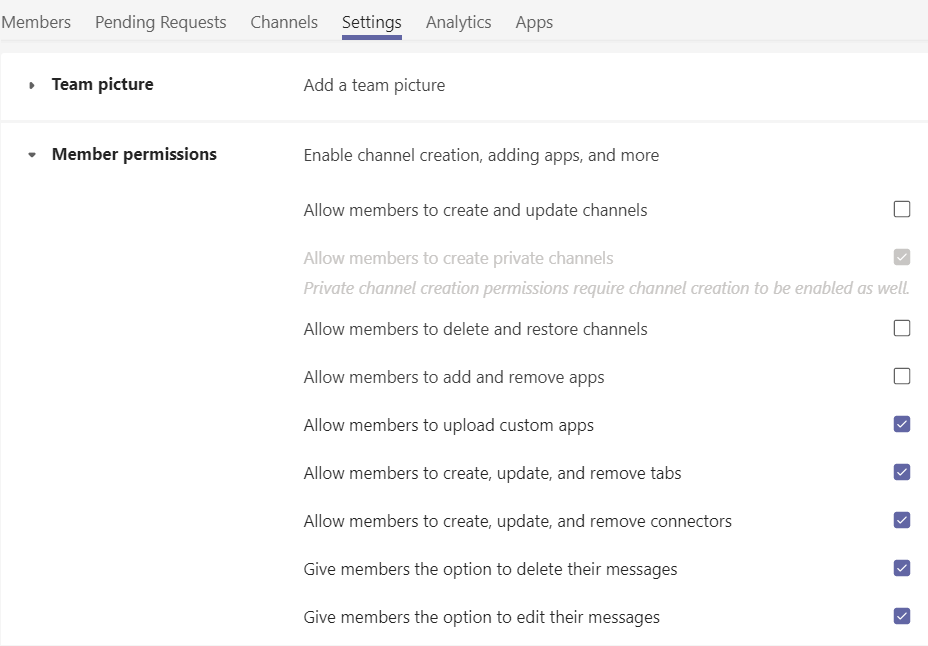

### Set up additional default channels

You may want to have additional channels where all students are members, such as an "announcements" or "random" channel.

1. From the "Manage Team" window, select "Channels"
2. Click "Add Channel"
3. Fill in Channel information
4. Select the "Automatically show this channel in everyone's channel list" checkbox.

Select "Admins, plus specific people" and add your TAs to this list so they can post announcements as well. This will lock down the channel so only you and your TAs can post here.

**NOTE:** If you want to add an Announcements channel where only course staff can post, first create the channel using the above method, then...

1. Select the three-dots dropdown for the channel and "Edit Channel"
2. Toggle "Channel Moderation" to "On" (This will make it so only owners/moderators can create new posts)
3. Remove any relevant channel-specific permissions (such as "Allow members to reply...")

### Recommended Channels

Some additional channels you may elect to use:

- **_Announcements_** (a default channel)  
Class-related announcements, or Teams-specific announcements (Office hours changes, etc.)
- **_Administration_** (private)  
Used to communicate with your TAs. When creating this, set it to private and invite only your course staff.
- **_TA Discussion_** (private to your TAs)  
Used among your TAs to discuss their duties.  It is recommended that you are not a member of this channel.
- **_Random_** (a default channel)  
Off-topic discussions, class related articles, memes, etc... within your course.

### Adding your TAs

Once it is created, you can add your TAs to the class Team using the in-client method. You may also need to add any co-instructors.

1. Select the three dots dropdown from the relevant Team, then select Add Member.
  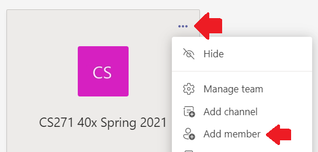
2. Enter the enough of the relevant individual's email address to trigger the autofill, and select Add Member.
3. You may alter the person's privileges here. Teams has only two options, Member and Owner. Use each at your discretion, but be aware that owner has fairly unlimited permissions.

## Adding Teams to your Canvas Navigation Panel

Students are encouraged to utilize Teams as an official course resource, so they should be provided a link in the course navigation panel. If your course does not already have this feature, it can be added as follows. NOTE: If you want this link to automatically enroll students who click it, see the directions in [Adding your Students](#adding-your-students).

1. In your course, select **Settings**.
2. Select the **Apps** tab.
3. Search *Redirect* and select the **Redirect tool** from the results.
4. Click on **+Add App**
5. Update Redirect settings as follows (see image below)
   - **Name:** Teams
   - **URL redirect:** https://teams.microsoft.com
   - *check:* **Force open in new tab (For External Links Only)**
   - *check:* **Show in Course Navigation**
   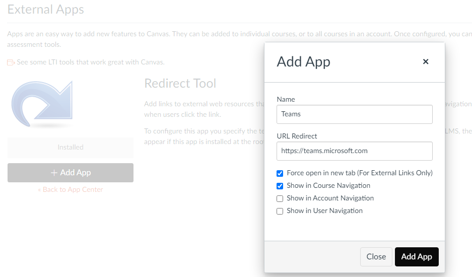

## Adding your Students

Once your class Team is created and set up, there are a few methods add your students. The in-client method is cumbersome and takes far too long. You may elect to paste this [Teams - How To (For Students) page](https://oregonstate.instructure.com/courses/1622724/pages/teams-how-to-for-students){:target="\_blank"} into your courses. Don't forget to snag the image and edit the page (specifically the join method and any changes to the channels) to fit your class!. I recommend putting this in the class Introduction module or in the Tools syllabus page subsection.

### Option 1 - Provide students a "Join Code" (Preferred)

For this method, you will create a short "Teams" page within Canvas and provide your students with a Code which they can enter via the Teams app to directly join the class Team.

1. From the "Manage Team" window, select the "Settings" tab, then find "Team Code"
2. Click "Generate"  
  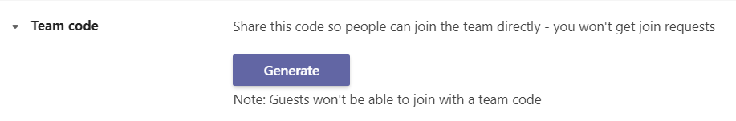
3. Copy this code for later.
4. In Canvas, create a Teams Page in your Course Introduction Module.
5. In this Page, reference the nav button and provide something like the following directions to the students:
   1. To join us on Microsoft Teams, visit the link in the nav bar ([https://teams.microsoft.com/](https://teams.microsoft.com/){:target="\_blank"}).
   2. Login with your OSU ONID and password
   3. Join the (Class Number) Team Channel using the Team Code (Team Code)

That's it! Your students will be able to add themselves and you won't need to do any confirmations. Unfortunately they can, in theory, share the code outside the class and OSU-credentialed individuals who aren't enrolled in the class would be able to join. If this is an issue...

### Option 2 - Link from course Navigation window (SPAMMY)

To have the link in your Canvas course's navigation window link directly to your class Team (rather than just to the general Teams site)...

1. From Teams, select the three-dots dropdown for your class Team, then select "Get link to team".  
  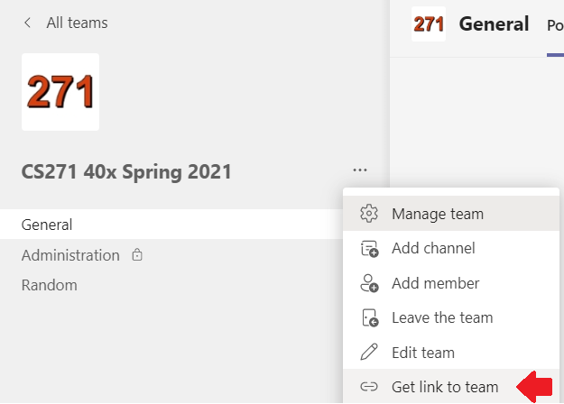
2. Copy this URL for later.
3. Follow steps 1-4 in [Adding Teams to your Canvas Navigation Panel](#adding-teams-to-your-canvas-navigation-panel).
4. Replace the **URL redirect** in Step 5 with the URL you copied above.

With this method, your students will directly link to your class Team. Every time a student clicks to join, you will get an email notifying you. With, potentially, a few hundred students this will quickly overwhelm your inbox (if you don't filter the requests).

### Option 3 - Auto-Enrollment (Forthcoming)

This is in progress and not functional yet. It should obsolete Options 1 and 2!

## Encouraging Use of Teams

One hurdle you may face is getting your students on-board and engaged. One significant way to boost usage is to hold all office hours (yours and your TAs') on Teams, but of course you need to give the students the information they need to get it up and running! The [Teams - How To (For Students) page](https://oregonstate.instructure.com/courses/1622724/pages/teams-how-to-for-students){:target="\_blank"} may also help in driving students to the Teams channels.

## Teams Tips & Tricks

1. In Teams - Click your profile photo and select Settings, then update the Layout to List (this will show all enrolled teams' channels instead of just one at a time) and possibly change to Darkmode.
2. Add Tags in your member management, have a Tag for instructors and another Tag for TAs/ULAs.
3. Teams supports in-line markdown
   - Single line code snippets: \`$host = $(hostname)\` -> `$host = $hostname`
   - Multi-line code snippets: with \`\`\`code here\`\`\` (not in lists, though)
   - **All** _the_ ~~other~~ markdown works too... \*\*All\*\* \_the\_ \~\~other\~\~ markdown works too.
4. If you want full blown syntax highlighting without dropping a file, you can use the button labeled `</>` in the rich text editor to include a larger portion of code
5. If you use your Exchange calendar, it's already integrated into Teams. You can also use a shared calendar for TA deadlines.
6. Live events and 'meet now' work great for as-needed video conferencing.
7. You can add all sorts of use apps to your Teams, tied to individual channels! From github integration to Trello or Tasks for management to Onenote or Evernote for notes.
8. Create assignment-specific channels, to keep conversation focused and easily searchable for those who aren't able to track Teams all day.
9. Use a Trello Tab to create tasks for TA's to track their duties.
   - They can mark 'in progress' or 'completed'.
   - You can even do time management allotment for each task.
   - This takes some Week 1 setup time, but afterwards the TA's just update their tasks as needed. It shows upon their calendar as when to _start_ and _complete_ tasks by.
10. Use of Timeneye for time keeping.
   - ULAs can start, pause, and save their timeclock by date and by Project and Phase.
   - This can help with those off-the-cuff (non-office-hours) timekeeping, then be uploaded to mytime.oregonstate.edu later.

## Other Teams Information

Your Team won't be the only one your students have.  Here is some information about how the student Team experience is configured.

**\*\*\* Info Placeholder - Hub is still held up\*\*\***
