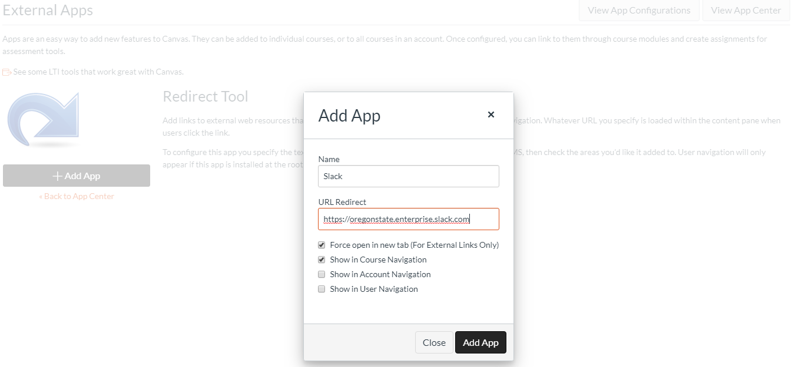

# Teams - How To

Microsoft Teams is a multi-platform connectivity app which is FERPA-approved and incorporates online chat and videoconferencing. It allows us to synchronously connect with our students to enhance their learning and increase student satisfaction. Think of it as a much-more-interactive chat client.  A Team is essentially a membership subset specific to some THING (like a course section, or the online program, or all OnlineCS instructors).

Teams is used to communicate with your students and encourage their learning in what feels like a much more in-person way. We've decided to incorporate it the standard tool for synchronous communications in our courses, and encourage you to employ it as much as possible.  This can take the form of office hours for yourself and your TAs, and tele-/video-conferencing at-a-click.  It can also be a place for you to talk about course-related and program-related materials in a more personal and approachable setting.  We will also use it for intra-departmental communication.

There are multiple methods to connect to Teams.  We recommend using the desktop application and mobile app. You can find links to download these at the [University IT Teams Site](https://is.oregonstate.edu/teams). You can also log in directly to Teams through a browser via the [Microsoft Teams URL](https://teams.microsoft.com/): https://teams.microsoft.com/ 

NOTE: Chris Thompson, College of Engineering IT Director, has made available a [recorded session demonstrating normal Teams functionality](https://it.engr.oregonstate.edu/lists/lt.php?tid=cUhbUwNVU1dQBRRTWgdVSAdTBwgaA1MEBxoHUQ0BB1UOBQxSVAVOAwBVCgdaB1BIVQdUCxpWAwsBGl9VUgFLAVwHAQIEBwRSVAQPTQYHVVNRUVcIGgQOV1MaUlQNXUsJCwVaHVAEBwdUVFgEUgBXBA). The [University IT Teams Site](https://is.oregonstate.edu/teams) also has Knowledge Base articles and Trainings available.

## Connecting to our Departmental Team

You should receive an email inviting you to our Departmental Team. After you've downloaded Teams, when you boot it up you should arrive at a login similar to the following.

Click on the OnlineCS Team - this will be (alongside email) the primary communication medium for EECS OnlineCS-related issues. Now you're in!

Here's how we use the OnlineCS Team. Feel free to request an invite if you're not already in some of these channels, and you'd like to be!

- onlinecs-instructors
  Ad-hoc discussions for all of our online instructors. Clarification of policies, requests for assistance/information, etc)
- onlinecs
  Questions/Interaction with staff/advisors associated with the OnlineCS programs, or general program questions/conversation.
- onlinecs-coursedev
  Conversations related to course development, current courses under development, etc.. Also a great place to pick brains of more experienced course developers.
- random  
  Random chat among department personnel (you!)
- general  
  Department-wide notes

## Starting a new Class Team

Now that you're set up and ready to go, it's time to create a Team for your students to connect to!  We are working on a method with increased automation, but for now the following is a workable method:

1. Open the [University IT Teams Site](https://is.oregonstate.edu/teams) and select "Request a Team".  
  
2. Click the Big Orange "Request Service" button. This will require you to log in with your ONID.
3. Fill in the form with your class information. We recommend including the course number, relevant section material, and the term, for record-keeping purposes.  
  
4. After you submit the request you should see a "Request Submitted" page.  You will also receive an email that your Service Request titled "Request for Team ...." has been submitted.
  
5. From here, it will take some time (1-2 business days) to have your Team added.  When it is, you'll receive an email from IT adding a comment to your service request. In Teams, you should also get a popup like the following:  
  

## Configuring your Class Team

Now that you have a Team for your class, it's time to get it properly setup for use.  There are a few setup procedures which follow here. To get started on setting these up, open Teams and get into the "Manage Team" window by clicking the "Three Dots" dropdown, then selecting "Manage Team".

### Improve Team Name & Description

From anywhere in Teams, you can select that same dropdown window and "Edit Team" to modify the Team name and description to be more intuitive and/or useful for the students.

### Update Team Icon

Updating the Team Picture will make it easier to navigate to the correct class' Team for students and for yourself.

1. From the "Manage Team" window, select the "Settings" tab, then find "Team Picture"
2. Download your class' Slack Workspace Icon from [HERE](https://drive.google.com/drive/folders/1RKscY825h54A9blY-hL6_dQesOgg6TG9) (We're re-using the Slack Icons) and upload it as the Team Picture.

### Alter Member Permissions

Teams defaults to allowing members a great amount of leeway in terms of permissions. You may want to restrict student access on certain items, for example uploading custom apps.

1. From the "Manage Team" window, select the "Settings" tab, then find "Member Permissions"
2. Remove any permissions you believe pertinent for your class Team.
3. It is suggested you remove permission to delete/restore channels, add/remove apps, and possibly create/update channels.  
  

### Set up additional default channels

You may want to have additional channels where all students are members, such as an "announcements" or "random" channel.

1. From the "Manage Team" window, select "Channels"
2. Click "Add Channel"
3. Fill in Channel information
4. Select the "Automatically show this channel in everyone's channel list" checkbox.

Select "Admins, plus specific people" and add your TAs to this list so they can post announcements as well. This will lock down the channel so only you and your TAs can post here.

**NOTE:** If you want to add an Announcements channel where only course staff can post, first create the channel using the above method, then...

1. Select the three-dots dropdown for the channel and "Edit Channel"
2. Toggle "Channel Moderation" to "On" (This will make it so only owners/moderators can create new posts)
3. Remove any relevant channel-specific permissions (such as "Allow members to reply...")

### Recommended Channels

Some additional channels you may elect to use:

- **_Announcements_** (a default channel)  
Class-related announcements, or Teams-specific announcements (Office hours changes, etc.)
- **_Administration_** (private)  
Used to communicate with your TAs. When creating this, set it to private and invite only your course staff.
- **_TA Discussion_** (private to your TAs)  
Used among your TAs to discuss their duties.  It is recommended that you are not a member of this channel.
- **_Random_** (a default channel)  
Off-topic discussions, class related articles, memes, etc... within your course.

### Provide students a link to your new **_\#general_** channel

Since Slack doesn't allow students the anonymity which Piazza does, we need to let our students 'opt in' to our class-oriented Slack channel.  We now have all the channels we need, but the students don't have any way to see the **_\#general_** channel. Let's give them a link.

- Back in your **_\#announcements_** channel, go back to the channel settings (See "Set up landing channel" image for help)
- Select "Additional Options" and "Set the channel description"
- Set the description to something like the following. The description will be visible until the posts of the channel push it off the screen.  
  "This channel is for class-wide communication and announcements. All members are in this channel by default, but only Instructors/TAs may post. For class discussion and office hours, please use the **_\#general_** channel."
- At the top of the channel there is a spot to set the channel topic which is, by default, "Company-wide announcements and work-based matters". Set the topic to "Join **_\#general_** for office hours and class discussion" or something along those lines.
- You may also elect to keep a link to **_\#general_** in the body of the most recent message in the channel.
- The point here is to always provide a visible link to **_\#general_** for students 'just now' joining your workspace or viewing it for the first time.
  
## Adding Teams to your Canvas Navigation Panel

Students are encouraged to utilize Slack as an official course resource, so they should be provided a link in the course navigation panel. If your course does not already have this feature, it can be added as follows.

1. In your course, select **Settings**.
2. Select the **Apps** tab.
3. Search *Redirect* and select the **Redirect tool** from the results.
4. Click on **+Add App**
5. Update Redirect settings as follows (see image below)
   - **Name:** Slack
   - **URL redirect:** https://oregonstate.enterprise.slack.com
   - *check:* **Force open in new tab (For External Links Only)**
   - *check:* **Show in Course Navigation**
   

## Adding your Students

Once it is created, there are a few methods to get your students and TAs added to the class Team. The TAs (and any other instructors) can be added using the in-client method.

1. Select the three dots dropdown from the relevant Team, then select Add Member.
  
2. Enter the enough of the relevant individual's email address to trigger the autofill, and select Add Member.
3. You may alter the person's privileges here. Teams defaults to two options, Member and 

*Hint: For help locating your TA usernames, you can use the search window at the bottom of this same page.*

That's it! Your students will be automatically added and you'll be the Workspace Administrator, which means you're responsible for managing all public channels.  Your students and TAs can create their own private channels for their own conversations, and everyone can Direct Message each other.

## Encouraging Use of Teams

One hurdle you may face is getting your students on-board and engaged. One significant way to boost usage is to hold all office hours (yours and your TAs') on Slack, but of course you need to give the students the information they need to get it up and running! I've taken the liberty of creating [this page](https://oregonstate.instructure.com/courses/1622724/pages/slack-how-to-for-students) which you can paste into your courses (don't forget to snag the image as well!). I recommend putting this in the first Module the students see, or in the Tools syllabus page subsection.

**\*\*\* Intro Activity Placeholder\*\*\***

## Other Slack Information

Your Workspace won't be the only one your students have.  Here is some information about how the student Slack experience is configured.
**\*\*\* Info Placeholder - Hub is still held up\*\*\***
