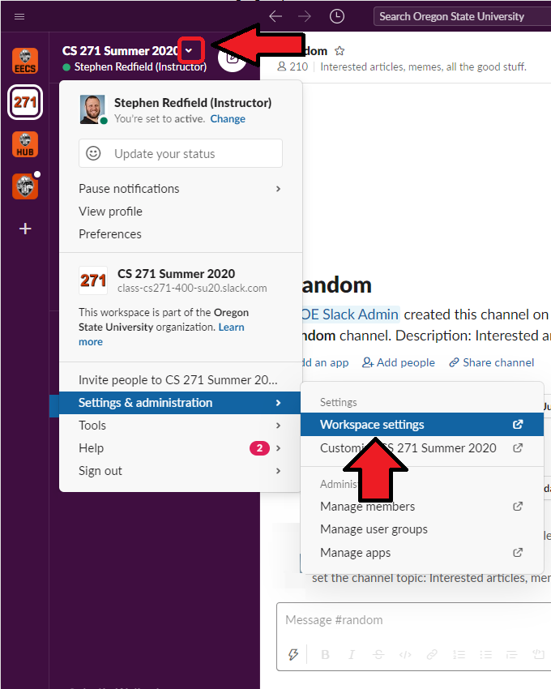

https://it.engr.oregonstate.edu/lists/lt.php?tid=cUhbUwNVU1dQBRRTWgdVSAdTBwgaA1MEBxoHUQ0BB1UOBQxSVAVOAwBVCgdaB1BIVQdUCxpWAwsBGl9VUgFLAVwHAQIEBwRSVAQPTQYHVVNRUVcIGgQOV1MaUlQNXUsJCwVaHVAEBwdUVFgEUgBXBA

# Slack - How To

Slack on our OSU enterprise Workspaces is a FERPA-approved, online chat and videoconferencing tool that is ideal for our synchronous student interaction needs. Think of it as a much-more-interactive chat client.  A Slack Workspace is essentially a membership subset specific to some THING (like a course section, for instance).

Slack is a fantastic tool for you to communicate with your students and encourage their learning in what feels like a much more in-person way. We've decided to incorporate it as a standard tool in our courses, and encourage you to employ it as much as possible.  This can take the form of office hours for yourself and your TAs, and tele-/video-conferencing at-a-click.  It can also be a place for you to talk about course-related and program-related materials in a more personal and approachable setting.  We will also use it for intra-departmental communication.

There are multiple methods to connect to Slack.  We recommend using the desktop application and mobile app. You can find links to download these at our [Departmental Slack Info Site](https://it.engineering.oregonstate.edu/slack). Alternately, entering the slack Workspace URL in your web browser will allow you to log on without downloading an application, but notifications don't work as well using this method.

NOTE: You can also view a [Demo](https://slackdemo.com/) which Slack has put out which shows many of its capabilities in use, and our [Departmental Slack Info Site](https://it.engineering.oregonstate.edu/slack) has some useful information as well.

## Connecting to our Departmental Workspace

After you've downloaded Slack, when you boot it up you should arrive at a login similar to the following.

Please connect to the Workspace [**_oregonstate.enterprise.slack.com_**](oregonstate.enterprise.slack.com) - this is the central connection point for all OSU-oriented slack workspaces. You should then select the "Sign in with ONID" and be able to connect. Now you're in!

Here's how we use the Departmental Slack:

- pb-instructors (request an invite if you're not already in!)  
  Ad-hoc discussions for all of our online instructors. Clarification of policies, requests for assistance/information, etc)
- random  
  Random chat among department personnel (you!)
- general  
  Department-wide notes

## Starting a new Class Workspace

Now that you're set up and ready to go, it's time to create a Workspace for your students to connect to!  Fortunately our ENGR IT department has setup a fairly simple method to do this for us:

1. Sign on to [TEACH](https://teach.engr.oregonstate.edu/) using your department login.  The login info is the same as your ONID login, but this requires an ENGR account. If you don't have one yet, please [contact support](https://it.engineering.oregonstate.edu/webform/email-support-engineering-it) to have one set up for you.
2. Select Class Administration from the TEACH navigation bar  

3. Select "Class Slack Workspace" and "Add a new class slack workspace".
4. Select your new course from the Course List menu
5. Add your TAs' ONID usernames to the "Special list members (TA's, etc):", separated by commas, and hit SUBMIT!  
*Hint: For help locating your TA usernames, you can use the search window at the bottom of this same page.*

That's it! Your students will be automatically added and you'll be the Workspace Administrator, which means you're responsible for managing all public channels.  Your students and TAs can create their own private channels for their own conversations, and everyone can Direct Message each other.

## Configuring your Class Workspace

Now that you have a Slack Workspace for your class, it's time to get it properly setup for use.  There are a few required setup procedures which follow here. To get started on setting these up, go to your class Workspace and get into the Workspace settings by clicking the Workspace dropdown, then selecting Workspace settings (under the "Settings & Administration" heading)

### Improve Workspace Name & Description

- In the Workspace Settings, under the "Settings" tab find "Workspace Name, Description, and URL."
- Alter the Name and Description to be more intuitive for the students, but don't touch the URL

  

### Update Workspace Icon

- In the Settings & Administration open "Customize [Workspace Name]", then find "Workspace Icon"
- Download your class' Slack Workspace Icon from [HERE](https://drive.google.com/drive/folders/1RKscY825h54A9blY-hL6_dQesOgg6TG9) and upload it as the Workspace Icon. This will make it easier to navigate to the correct class' workspace for students and yourself.

### Set up landing channel

It is important for the landing channel to be a neutral environment for our students.  Slack provides two channels by default (**_\#general_** and **_\#random_**) but **_\#general_** is the landing point - ideal for announcements but poorly named.  Additionally, for multi-section workspaces we can't have the landing point be the regular Q & A channel (due to FERPA issues). It should be renamed to **_\#announcements_**, posting permissions should be restricted...

- Back in your Slack app in your class Workspace, enter the **_\#general_** channel and click "&#9432; Details" on the top right. "The "Details" word may be hidden.  

- Choose "... More Options" then "Rename this Channel" and rename the channel to "announcements"
- Select "... More Options" again and select "Manage Posting Permissions". Select "Admins, plus specific people" and add your TAs to this list so they can post announcements as well. This will lock down the channel so only you and your TAs can post here.

### Set up new **_\#general_** channel  

Every student who joins your workspace will now land in **_\#announcements_** but be unable to post there.  This makes it a good place to post announcements, but we've now robbed ourselves of a **_\#general_** channel for Q & A. We'll have to make a new one and provide a link for students to "opt in" to that channel, and then we can use it for office hours and other synchronous communications.

- To create a new channel, within the Slack application's left navigation bar, next to the "Channels" heading there should be a "+". Click this button to create a new **_\#general_** channel and set its description.
  - A channel description is displayed to all who join that channel - you can set this one for however you intend to use it, but we'll need the description for the **_\#announcements_** channel for something special.

### Provide students a link to your new **_\#general_** channel

Since Slack doesn't allow students the anonymity which Piazza does, we need to let our students 'opt in' to our class-oriented Slack channel.  We now have all the channels we need, but the students don't have any way to see the **_\#general_** channel. Let's give them a link.

- Back in your **_\#announcements_** channel, go back to the channel settings (See "Set up landing channel" image for help)
- Select "Additional Options" and "Set the channel description"
- Set the description to something like the following. The description will be visible until the posts of the channel push it off the screen.  
  "This channel is for class-wide communication and announcements. All members are in this channel by default, but only Instructors/TAs may post. For class discussion and office hours, please use the **_\#general_** channel."
- At the top of the channel there is a spot to set the channel topic which is, by default, "Company-wide announcements and work-based matters". Set the topic to "Join **_\#general_** for office hours and class discussion" or something along those lines.
- You may also elect to keep a link to **_\#general_** in the body of the most recent message in the channel.
- The point here is to always provide a visible link to **_\#general_** for students 'just now' joining your workspace or viewing it for the first time.
  
## Recommended Channels

Some additional channels you may elect to use:

- **_\#administration_** (private)  
Used to communicate with your TAs.
- **_\#ta_discussion_** (private to your TAs)  
Used among your TAs to discuss their duties.  It is recommended that you are not a member of this channel.
- **_\#random_** (a default channel)  
Off-topic discussions, class related articles, memes, etc... within your course.

## Adding Slack to your Canvas Navigation Panel

Students are encouraged to utilize Slack as an official course resource, so they should be provided a link in the course navigation panel. If your course does not already have this feature, it can be added as follows.

1. In your course, select **Settings**.
2. Select the **Apps** tab.
3. Search *Redirect* and select the **Redirect tool** from the results.
4. Click on **+Add App**
5. Update Redirect settings as follows (see image below)
   - **Name:** Slack
   - **URL redirect:** https://oregonstate.enterprise.slack.com
   - *check:* **Force open in new tab (For External Links Only)**
   - *check:* **Show in Course Navigation**
   

## Encouraging Use of Slack

One hurdle you may face is getting your students on-board and engaged. One significant way to boost usage is to hold all office hours (yours and your TAs') on Slack, but of course you need to give the students the information they need to get it up and running! I've taken the liberty of creating [this page](https://oregonstate.instructure.com/courses/1622724/pages/slack-how-to-for-students) which you can paste into your courses (don't forget to snag the image as well!). I recommend putting this in the first Module the students see, or in the Tools syllabus page subsection.

**\*\*\* Intro Activity Placeholder\*\*\***

## Other Slack Information

Your Workspace won't be the only one your students have.  Here is some information about how the student Slack experience is configured.
**\*\*\* Info Placeholder - Hub is still held up\*\*\***
