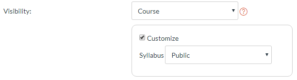

# Pre-term Checklist Guide

The intent of this document is to provide a handy checklist of items which each OnlineCS Post-Bacc course must contain by the start of each term, as well as providing information on how to create/link to each of the items.

**Required Items are BOLD**.

Upon completion of this list, test whether the Syllabus page is visible in the correct format to current and prospective students. To do so, utilize a cache-free browser mode such as Chrome's Incognito, browse to the [myCOE course list](http://classes.engr.oregonstate.edu/eecs), and click the link for your class.

## General Course Setup Requirements

- **Multiple-Section Courses Merged using the [Course Merge Tool](CourseMerge.html)** (Some exceptions).
- **Canvas Syllabus Page linked in [myCOE course list](http://classes.engr.oregonstate.edu/eecs)**
  1. Add link to Canvas Syllabus via TEACH
  2. Go to [ENGR TEACH](https://teach.engr.oregonstate.edu/)
  3. Select "Class Administration" (Bottom Right)
  4. “Add a different URL to http://classes.engr.oregonstate.edu”
  5. Update your class’ link to be the Syllabus page of your Canvas class.  
*NOTE: The format of this URL will be https://canvas.oregonstate.edu/courses/\*\*/assignments/syllabus , where \*\* is the Canvas Course ID#.*
  6. Make your class’ syllabus page public via “Settings” -> "Course Details" in Canvas.  
*NOTE: The course must be published for these pages to be visible to prospective students*
  
- **Course Syllabus (page or PDF) has a “Communication Policy” which specifies the proper mechanism to get in touch with Instructor/TAs.**
- **Course Syllabus conforms to [Academic Integrity Requirements](PreventingAcademicMisconduct.html).**
- **Ed Discussions set up for course and present in Navigation bar**  
See [Ed Discussions – How To](EDSetup.html)
- **Class Team setup for course and present in Navigation bar**  
See [Teams – How To](TeamsSetup.html)
- **TutorMe or CoE Tutoring (https://engineering.oregonstate.edu/current-students/academic-support/undergraduate-tutoring) link present in Navigation bar**  
For the following classes, use ONLY CoE Tutoring (no TutorMe support): CS 161, CS 162, CS 261, CS 271, and CS 344
- **Course Home Page (page you land on when you enter a course through the Canvas Class List) includes post-bacc Banner for the course**  
([Find Banners Here](https://drive.google.com/drive/folders/1RKscY825h54A9blY-hL6_dQesOgg6TG9))

- **ReadMe First Page**  
A page within your course (possibly in the first Module) which will orient the student within your course. I usually use this as my “Home Page” for the first week of each term. May include items such as...  
  1. Course Assignment Overview
  2. Keys to Success
  3. What students can expect from you
  4. Information about announcements
  5. Link to course Syllabus Page (syllabus)
  6. …

- **Set up any proctored exams at Exams & Proctoring Site**  
See [Proctored Exams](ProctoredExams.html)

- **"Portfolio" assignment included in coursework**  
With the exception of a few classes (CS101, CS161, CS225) all our online offerings must have one assignment designated as a *Portfolio assignment*.  Students must be authorized by the instructor to post the entirety of the assignment publicly (e.g. Github, personal website, etc...).  

## Canvas Syllabus Page Requirements

Please use this [template file](docs/Week0Template.txt) for assistance in formatting the Syllabus page. There is also a more detailed [video guide](media/Week0DemoVideo.mp4).

- **The following materials are part of the Canvas “Syllabus” page, and are presented by HTML tabs.**
- **TAB: Course Introduction**
  - **Meet the Instructor Video** (Course instructor self-intro, background, etc)
    - For this to be publicly visible. Login to https://media.oregonstate.edu/, select the video, then "Share", then "Embed". Copy the iframe HTML and place that into the syllabus HTML.
  - Course Justification Video (Explains the purpose of this course in the Program)
  - Course Designer Intro Video (course designer self-intro, background, etc)
  - Instructional Strategies (discusses reason for strategies used in the course)
  - Assessment Rationale (discusses reason for assessments in the course)
- **TAB: Syllabus & Schedule**
  - **Course Syllabus**
   Must be either a linked, downloadable PDF or HTML with a “Download Me!” button to generate a downloadable PDF
  - **Course Schedule**  
  Must be either a linked, downloadable PDF or HTML with a “Download Me!” button to generate a downloadable PDF
  - **Syllabus Quiz Link**
- **TAB: Where to go for help**
  - **Preferred Instructor Contact Info**
  - **Office Hours Schedule (with links if linkable)**
  - **Teams Link (https://teams.microsoft.com) with info on usage**
  - **Link to discussion board**
  - TA Contact Info (if needed)
  - Link to eCampus Resources
- TAB: Tools  
Setup info for tools used in class, e.g….
  - Setup up Visual Studio or Eclipse
  - Finding/installing network monitoring tools
  - Accessing FLIP for program testing
- **Above or Below the tabular format, include note “NOTE: Some links on this page may only be accessible to registered students.”**
